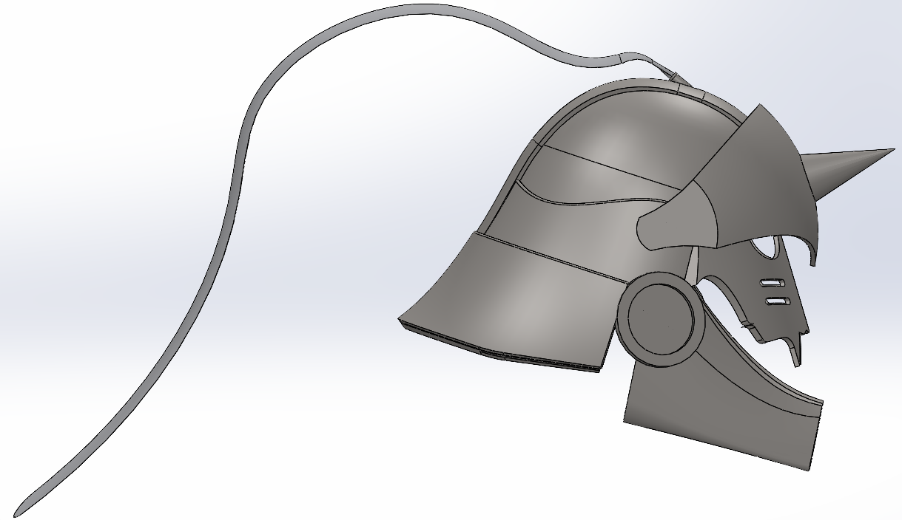
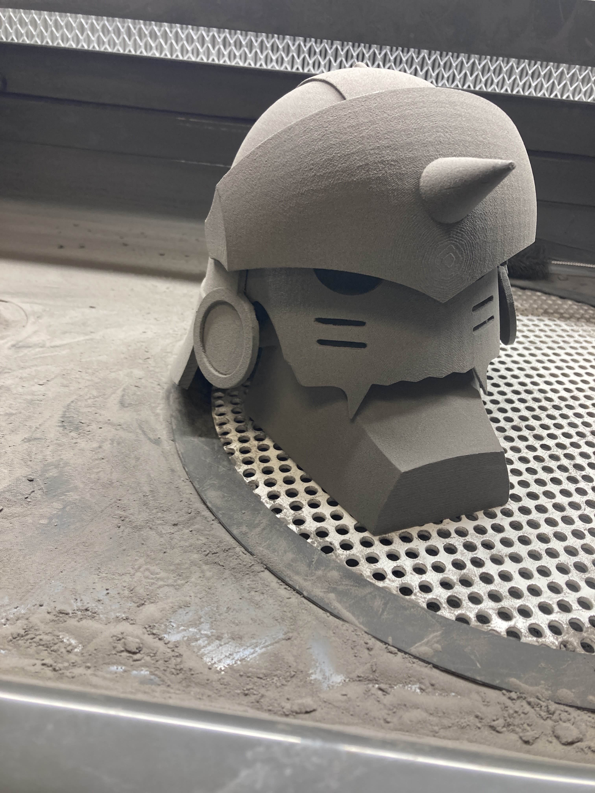

# 🦾 FMA Helmet
*Helmet design inspired by Alphonse Elric from Fullmetal Alchemist*

---

## 🚀 Overview
- This project was done for the Advanced CAD Design course at FRCC
- Helmet was designed to be wearable (printed with SLS Nylon), and accurate to the reference source
- First complex surface modeling project; an exploration of organic geometries and features (images link to STL)
  
  
---

## 🧠 Key Features
- 🔹Helmet Base
  - 🔹used organic curvatures to replicate "samurai" style layers
  - 🔹designed to be easily modified to fit any size head
  
- 🔹Facial Mask
  - 🔹all parts on "face" are adjustable to allow for different face shapes
  
  
  
- 🔹Designed to be printed-in-assembly via SLS
- SLS Fabrication
  
---

## 🛠️ Technical Details

| Aspect | Description                     |
|:--|:--------------------------------|
| **Tools / Languages** | SolidWorks                      |
| **Libraries / Frameworks** | N/A                             |
| **Hardware Used** | 3D printed parts                |
| **Fabrication** | SLS 3D printing |
| **Data I/O** | STEP/STL models, .gcode         |

---
